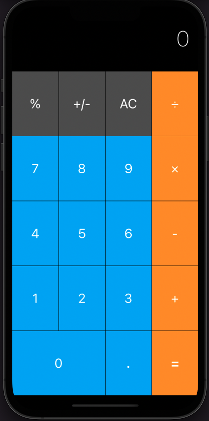
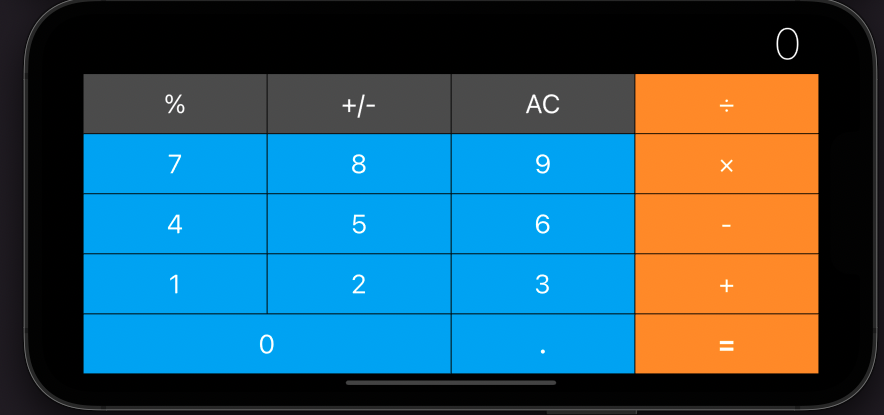
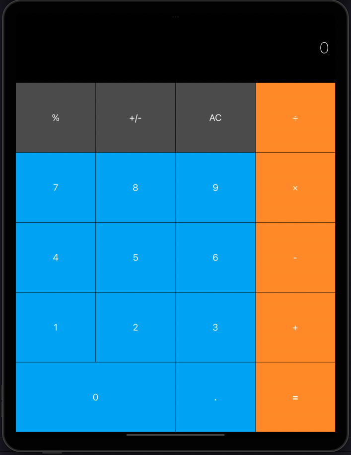
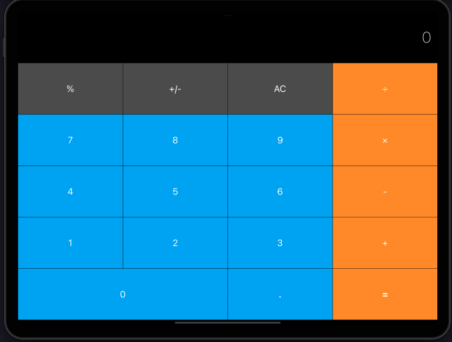

# Calculator Layout 

This "Calculator" application is a simple one screen design of calculator screen i have made this single screen design application just to practice AutoLayout concepts. This application supports all Screen Sizes and Orientation in iphone and iPad.

## What i have learnt while building "Rolling Dice (AutoLayout Version)" application?

--> How to add constraints and understand how auto layout works.

--> How to Pin and Align UI elements.

--> How to create containers to configure advanced layouts.

--> How to debug auto layout errors.

--> I have learned the pre-requisites to automatic layout.

--> How to use stack views to easily layout your UI.

## Screenshots

----> iPhone 13 Pro Max

 

----> iPhone 13 Pro Max

----> iPad Pro(5th generation)

 

----> iPad Pro(5th generation)

 

